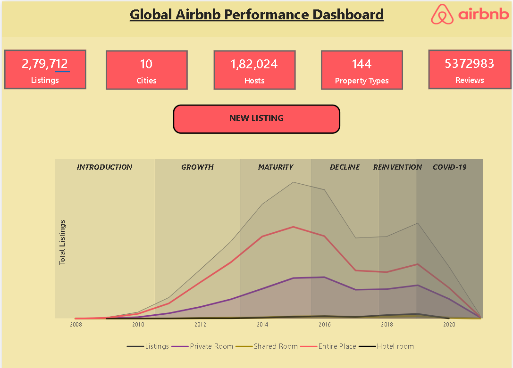
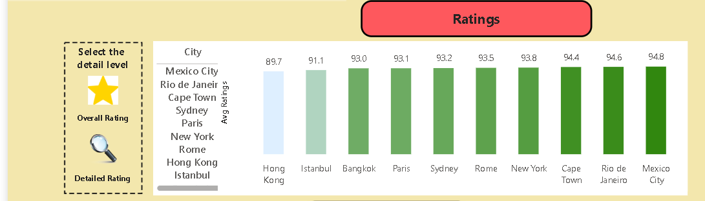

# 📊 Dashboard Screenshots

This folder contains screenshots of the **Airbnb Global Performance Dashboard** developed using Microsoft Power BI.

The screenshots provide a visual preview of the dashboard without requiring Power BI to be installed.

## 🏠 Dashboard Overview

This page provides an overall view of Airbnb performance, including key KPIs, listing trends, property types, hosts, reviews, and other important metrics.

## ⭐ Ratings Analysis

This page focuses on customer ratings and satisfaction across different cities and rating categories such as:

- Accuracy
- Cleanliness
- Communication
- Location
- Value

## 🌎 Market Analysis

This page provides insights into city-level Airbnb market performance, including listing distribution, market share, pricing, and host performance.

## 🛠️ Tool Used

**Microsoft Power BI**

## 📌 Note

These screenshots are provided for portfolio and demonstration purposes. The complete Power BI `.pbix` file and original datasets are not included in this repository due to their large file sizes.
